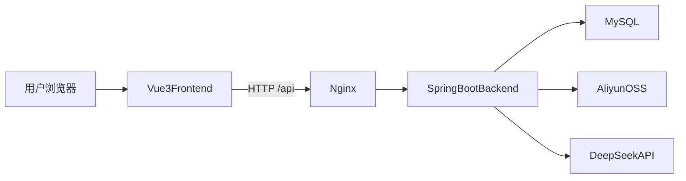
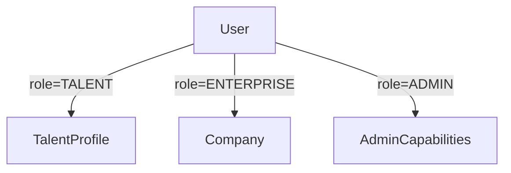

# 项目总览

## 1. 项目是什么

`talent-platform` 是一个面向软件产业人才公共服务场景的全栈平台。它同时服务四类对象：

- 访客：浏览岗位、课程、资讯、平台大屏等公开内容。
- 人才用户：维护个人档案、投递岗位、参加课程、领取证书、使用 AI 职业评估。
- 企业用户：维护企业资料、等待审核、发布岗位、查看申请、浏览人才、使用 AI 匹配人才。
- 管理员：审核企业与资讯、维护课程、管理人才展示、查看监控统计、操作区块链后台。

从产品定位看，它不是单一招聘网站，而是把“招聘服务、人才展示、学习认证、资讯政策、AI 辅助、后台运营”整合到了同一个平台。

## 2. 项目目标

这个项目试图解决三个层面的问题：

1. 对人才端，提供求职、成长、评估、认证的一体化入口。
2. 对企业端，提供审核后的招聘发布和人才检索能力。
3. 对平台运营端，提供内容治理、审核、监控与数据展示能力。

对技术学习者来说，它还具备一个额外价值：这是一个结构相对完整、功能跨域较多、既有前台也有后台的全栈学习样本。

## 3. 核心能力全景

### 3.1 人才服务

- 创建和编辑人才档案
- 上传头像
- 维护技能、教育、项目经历、自我介绍、证书等信息
- 浏览岗位并投递
- 查看申请状态

### 3.2 企业服务

- 创建企业资料
- 查看企业审核状态
- 审核通过后发布、修改、关闭、删除岗位
- 查看收到的申请
- 浏览公开人才与精选人才

### 3.3 AI 能力

- AI 匹配岗位
- AI 匹配人才
- AI 推荐课程
- AI 职业能力评估
- 管理端 AI 推荐展示人才

### 3.4 学习与证书

- 浏览课程
- 报名课程
- 学习进度跟踪
- 完成课程后领取证书
- 将证书写入模拟区块链

### 3.5 资讯与内容治理

- 展示资讯、公告、政策内容
- 管理员审核爬取内容
- 发布手工公告
- 后台触发内容采集任务

### 3.6 后台与数据

- 用户管理
- 企业审核和展示控制
- 人才展示控制
- 课程管理
- 资讯审核
- API 监控与统计
- 区块链后台管理

## 4. 技术栈

## 前端

- `Vue 3`
- `Vite`
- `Element Plus`
- `Pinia`
- `Vue Router`
- `Axios`
- `ECharts`

前端工程位于 [`../frontend`](../frontend)。

## 后端

- `Spring Boot 3.2.3`
- `Spring Security`
- `JWT`
- `Spring Data JPA`
- `Spring AOP`
- `WebClient`
- `Validation`
- `OpenPDF`
- `Jsoup`
- `Aliyun OSS SDK`

后端工程位于 [`../backend`](../backend)。

## 基础设施

- `MySQL 8.0`
- `Docker Compose`
- `Nginx`
- `Aliyun OSS`
- `DeepSeek API`

## 5. 总体架构

项目采用“前后端分离 + 单体后端”的结构。

### 架构特点

- 前端是标准单页应用，路由和页面都在浏览器端完成。
- 后端是一个单体应用，但业务域覆盖较广。
- 认证采用 JWT 无状态方案。
- 数据层使用 JPA，数据库结构主要由实体类和 `ddl-auto: update` 演进。
- AI、OSS、区块链、通知、统计、爬虫等能力通过服务类整合进同一后端。

## 6. 目录结构概览

### 核心目录

- [`../frontend`](../frontend)：前端应用
- [`../backend`](../backend)：后端应用
- [`../docs`](./README.md)：本套文档

### 部署与配置

- [`../docker-compose.yml`](../docker-compose.yml)
- [`../nginx.conf`](../nginx.conf)
- [`../deploy.sh`](../deploy.sh)
- [`../.env.example`](../.env.example)

### 展示与答辩素材

- [`../../ppt-materials/screenshots`](../../ppt-materials/screenshots)
- [`../../ppt-materials/architecture-diagram.html`](../../ppt-materials/architecture-diagram.html)
- [`../../ppt-materials/deploy-diagram.html`](../../ppt-materials/deploy-diagram.html)

## 7. 角色模型

后端角色由 `User.role` 定义，共三种：

- `ADMIN`
- `TALENT`
- `ENTERPRISE`

注册页只允许创建 `TALENT` 和 `ENTERPRISE`。管理员由初始化逻辑创建。

### 角色关系

### 角色在前端中的典型入口

- 人才用户：通常从 `/jobs`、`/my-profile`、`/career-assessment`、`/courses`、`/certificates` 进入主要流程。
- 企业用户：通常从 `/company`、`/company/jobs`、`/talents`、`/match` 进入主要流程。
- 管理员：登录后默认进入 `/admin`。

## 8. 页面与能力地图

### 公共页面

- 首页 `/`
- 登录 `/login`
- 注册 `/register`
- 岗位列表 `/jobs`
- 岗位详情 `/jobs/:id`
- 智能匹配 `/match`
- 课程列表 `/courses`
- 课程详情 `/courses/:id`
- 政策资讯 `/policies`
- 政策详情 `/policies/:id`
- 数据大屏 `/data-screen`

### 登录后页面

- 职业评估 `/career-assessment`
- 证书列表 `/certificates`
- 证书详情 `/certificates/:id`
- 企业资料 `/company`
- 企业岗位 `/company/jobs`
- 人才档案 `/my-profile`
- 我的申请 `/my-applications`
- 通知中心 `/notifications`

### 企业 / 管理员可访问页面

- 人才列表 `/talents`
- 人才详情 `/talents/:id`
- 人才展示 `/talent-showcase`

### 管理后台页面

- `/admin`
- `/admin/users`
- `/admin/news`
- `/admin/courses`
- `/admin/companies`
- `/admin/showcase`
- `/admin/monitor`
- `/admin/blockchain`

## 9. 关键运行配置

### 前端

- 开发端口固定为 `5173`
- 代理 `/api` 到 `http://localhost:8080`
- 使用 `@` 指向 `src`

### 后端

- 服务端口 `8080`
- 默认数据库 `talent_platform`
- JPA 使用 `ddl-auto: update`
- 文件上传上限 `500MB`
- JWT 默认有效期 `86400000` 毫秒，即 24 小时

### 环境变量

主要环境变量来自 [`../.env.example`](../.env.example)：

- `DEEPSEEK_API_KEY`
- `OSS_ENDPOINT`
- `OSS_ACCESS_KEY_ID`
- `OSS_ACCESS_KEY_SECRET`
- `OSS_BUCKET_NAME`

## 10. 默认账号与演示数据

项目启动时会执行 [`../backend/src/main/java/com/talent/platform/config/DataInitializer.java`](../backend/src/main/java/com/talent/platform/config/DataInitializer.java)：

- 自动创建管理员账号 `admin / admin123`
- 当企业表为空时，自动灌入演示企业、岗位、资讯、课程数据

默认演示企业账号：

- `jingzhou_tech / demo123`
- `xingyun_data / demo123`
- `lanyue_net / demo123`

这意味着项目非常适合演示和答辩，但也意味着文档中必须明确区分“演示数据”和“真实业务数据”。

## 11. 可视化素材入口

下面这些图和截图适合在总览、答辩、培训资料中直接引用。

### 架构图

### 部署图

### 首页首屏

### AI 匹配结果

### 职业评估

## 12. 项目适合如何理解

如果你是用户，应把它理解成一个“求职 + 招聘 + 学习 + 平台服务”的综合平台。

如果你是开发者，应把它理解成一个“功能模块较多、业务域完整、前后端边界清晰、适合二开和答辩展示”的全栈样本。

如果你是学习者，应把它理解成一个“真实工程取舍明显”的项目：

- 它有比较完整的业务线。
- 它不是完美的教科书式架构。
- 它既有值得学习的完整实现，也有值得分析和改进的现实问题。

这正是它适合被写成详细文档的原因。

## 13. 下一步阅读建议

- 想先学怎么用平台，看 [`02-user-guide.md`](./02-user-guide.md)
- 想先学前端怎么组织，看 [`03-frontend-guide.md`](./03-frontend-guide.md)
- 想先学后端怎么工作，看 [`04-backend-architecture.md`](./04-backend-architecture.md)
