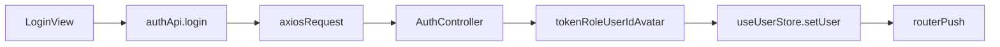
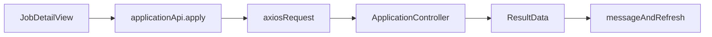
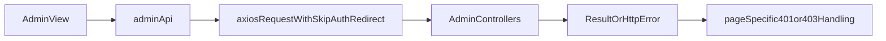

# 前端开发指南

这份文档从前端工程视角解释 `talent-platform` 的页面组织、路由、状态管理、API 封装和常见开发入口。

前端工程位于 [`../frontend`](../frontend)。

## 1. 技术栈与运行方式

前端使用：

- `Vue 3`
- `Vite`
- `Element Plus`
- `Pinia`
- `Vue Router`
- `Axios`
- `ECharts`

核心配置来自：

- [`../frontend/package.json`](../frontend/package.json)
- [`../frontend/vite.config.js`](../frontend/vite.config.js)

### 运行特征

- 开发端口固定为 `5173`
- `strictPort: true`，端口被占用时不会自动切换
- `/api` 请求代理到 `http://localhost:8080`
- 支持把 query 中的 `token` 转成 `Authorization` 头再转发给后端

这意味着：

- 前后端本地联调非常直接
- 登录态和端口绑定，切换端口可能导致本地状态不共享

## 2. 工程目录结构

前端主要结构如下：

```text
frontend/
├── src/
│   ├── api/          # 请求实例与业务 API 封装
│   ├── assets/       # 样式和静态资源
│   ├── components/   # 通用组件
│   ├── router/       # 路由定义与前置守卫
│   ├── stores/       # Pinia 状态
│   ├── utils/        # 搜索筛选逻辑等工具函数
│   ├── views/        # 页面组件
│   └── main.js       # 前端入口
```

建议开发者优先熟悉以下文件：

- [`../frontend/src/main.js`](../frontend/src/main.js)
- [`../frontend/src/App.vue`](../frontend/src/App.vue)
- [`../frontend/src/router/index.js`](../frontend/src/router/index.js)
- [`../frontend/src/stores/user.js`](../frontend/src/stores/user.js)
- [`../frontend/src/api/request.js`](../frontend/src/api/request.js)
- [`../frontend/src/api/index.js`](../frontend/src/api/index.js)

## 3. 启动入口与应用壳

### 3.1 入口

`main.js` 负责：

- 创建 Vue 应用
- 注册 Pinia
- 注册 Router
- 挂载 Element Plus

这是标准的 Vue 3 SPA 入口结构。

### 3.2 App 壳层

`App.vue` 的职责通常包括：

- 渲染路由视图
- 控制全局头部是否显示

当前项目通过路由 meta 中的 `hideHeader` 来控制某些页面不显示头部，例如：

- `/login`
- `/register`
- `/data-screen`

## 4. 路由设计

路由集中定义在 [`../frontend/src/router/index.js`](../frontend/src/router/index.js)。

## 4.1 页面分层

### 公开页

- `/`
- `/login`
- `/register`
- `/jobs`
- `/jobs/:id`
- `/match`
- `/courses`
- `/courses/:id`
- `/policies`
- `/policies/:id`
- `/data-screen`

### 登录后页

- `/career-assessment`
- `/certificates`
- `/certificates/:id`
- `/company`
- `/company/jobs`
- `/my-profile`
- `/my-applications`
- `/notifications`

### 企业 / 管理员可见的人才浏览页

- `/talents`
- `/talents/:id`
- `/talent-showcase`

### 管理后台

- `/admin`
- `/admin/users`
- `/admin/news`
- `/admin/courses`
- `/admin/companies`
- `/admin/showcase`
- `/admin/monitor`
- `/admin/blockchain`

## 4.2 路由守卫

路由守卫的核心逻辑是三类 meta：

- `requiresAuth`
- `requiresAdmin`
- `requiresTalentBrowse`

### 守卫行为

- 未登录访问登录保护页时，跳转到 `/login`
- 非管理员访问后台时，已登录则回首页，未登录则去登录页
- 非企业/管理员访问人才库时：
  - 未登录则去登录页
  - 已登录但角色不符则提示并跳转

### 一个重要实现细节

前端对“人才库浏览权限”的处理比“普通登录校验”更细：

- 企业和管理员可以浏览公开人才
- 人才自己不能进入人才库

这很好地体现了角色能力差异。

### 一个需要注意的地方

并不是所有登录后页面都做了严格角色区分，例如：

- `/my-profile`
- `/company`
- `/company/jobs`

这些页面主要依赖业务语义和页面逻辑，而不是路由层强角色约束。因此开发新功能时，不能只看路由守卫，还要看页面和后端接口是否进行了角色兜底。

## 5. 状态管理

状态管理集中在 [`../frontend/src/stores/user.js`](../frontend/src/stores/user.js)。

这是一个非常核心的文件，因为它决定了：

- 当前是否登录
- 当前用户是谁
- 当前是什么角色
- 哪些页面能看
- token 过期时如何自动退出

## 5.1 保存的状态

- `token`
- `username`
- `role`
- `userId`
- `avatarUrl`

这些值都通过 `localStorage` 持久化。

## 5.2 派生状态

- `isLoggedIn`
- `isAdmin`
- `isTalent`
- `isEnterprise`
- `canBrowseTalents`

其中 `canBrowseTalents` 是一个很有代表性的前端权限派生状态：

- 企业可浏览人才
- 管理员可浏览人才
- 人才自己不可浏览人才库

## 5.3 Token 过期处理

前端会主动解析 JWT 的 payload：

- 如果发现 `exp` 已过期，启动时就清空本地状态
- 避免出现“看起来像登录了，但实际上接口一直 401”的伪登录状态

这是一个很实用的前端防护设计。

## 6. API 层设计

API 层分两部分：

- [`../frontend/src/api/request.js`](../frontend/src/api/request.js)：Axios 实例和拦截器
- [`../frontend/src/api/index.js`](../frontend/src/api/index.js)：业务 API 分组

## 6.1 请求实例

`request.js` 负责：

- 统一设置 `baseURL: '/api'`
- 设置默认超时时间 `60000`
- 在请求头里自动注入 `Authorization: Bearer <token>`
- 处理响应异常

### 401 处理

如果响应状态是 `401`：

- 默认清空本地状态
- 跳回 `/login`

但如果配置了 `skipAuthRedirect: true`，则不会触发全局自动退登。

### 403 处理

`403` 默认不做统一 toast，而是把处理权交给业务页面。

这对后台管理页尤其重要，因为后台页需要区分：

- 401：登录失效
- 403：权限不足

## 6.2 业务 API 分组

当前业务分组已经比较清晰：

- `authApi`
- `talentApi`
- `jobApi`
- `companyApi`
- `applicationApi`
- `newsApi`
- `courseApi`
- `matchApi`
- `aiApi`
- `blockchainApi`
- `recruitmentApi`
- `fileApi`
- `adminApi`
- `statsApi`
- `notificationApi`

这份文件本身就可以视为“前端可见接口地图”。

## 6.3 后台 API 的特殊约定

`adminApi` 统一给请求加了 `skipAuthRedirect: true`。

这样做是为了避免：

- 管理员页面请求 `401` 时被全局拦截器直接清本地状态
- 用户感觉“点一下后台就自动退出”

这是当前项目很值得保留的实践约定。

## 7. 页面组织方式

页面位于 [`../frontend/src/views`](../frontend/src/views)。

### 7.1 用户侧页面

常见页面可以分为几类：

#### 门户与展示

- `Home.vue`
- `DataScreen.vue`

#### 账号与身份

- `Login.vue`
- `Register.vue`

#### 人才侧

- `MyProfile.vue`
- `CertificateList.vue`
- `CertificateDetail.vue`
- `CareerAssessment.vue`

#### 企业侧

- `CompanyProfile.vue`
- `CompanyJobs.vue`

#### 招聘主流程

- `JobList.vue`
- `JobDetail.vue`
- `MyApplications.vue`
- `TalentList.vue`
- `TalentDetail.vue`
- `TalentShowcase.vue`
- `Match.vue`

#### 内容与学习

- `PolicyList.vue`
- `PolicyDetail.vue`
- `CourseList.vue`
- `CourseDetail.vue`
- `NotificationCenter.vue`

### 7.2 管理后台页面

后台页面位于 [`../frontend/src/views/admin`](../frontend/src/views/admin)：

- `Dashboard.vue`
- `UserManage.vue`
- `NewsManage.vue`
- `CourseManage.vue`
- `CompanyManage.vue`
- `TalentShowcaseManage.vue`
- `SystemMonitor.vue`
- `BlockchainManage.vue`

## 8. 搜索与筛选实现

搜索面板组件和工具函数分离，是当前前端里比较清晰的一部分。

### 页面组件

- `JobSearchPanel.vue`
- `TalentSearchPanel.vue`
- `CourseSearchPanel.vue`
- `PolicySearchPanel.vue`

### 工具函数

- `jobSearch.js`
- `talentSearch.js`
- `courseSearch.js`
- `policySearch.js`

这种分法的好处是：

- 搜索 UI 可读
- 筛选逻辑可复用
- 更容易把“筛选规则”和“页面结构”解耦

## 9. 典型前端数据流

## 9.1 登录流



## 9.2 人才投递流



## 9.3 后台管理流



## 10. 前端开发时最常见的入口点

### 新增一个页面

通常需要改：

1. `src/views/` 新增页面组件
2. `src/router/index.js` 注册路由
3. `src/components/AppHeader.vue` 或相关导航处增加入口
4. `src/api/index.js` 增加接口封装

### 新增一个后台页面

通常需要额外注意：

- 路由 meta 设为 `requiresAdmin: true`
- 请求使用 `skipAuthRedirect: true`
- 页面内部明确处理 `401` 和 `403`

### 新增一个需要登录的功能

通常需要同时关注：

- 页面路由保护
- 用户状态是否来自 `useUserStore`
- Axios 是否自动带 token
- 后端是否会返回真实 `401/403`

## 11. 前端实现中的亮点

- 登录状态持久化和 token 过期主动清理
- 后台接口 `skipAuthRedirect` 约定清晰
- 路由守卫对人才浏览权限做了独立建模
- API 分组较清晰，便于查找
- 角色驱动的页面复用较多，例如 `/my-applications` 和 `/match`

## 12. 前端实现中的注意点

- 页面级角色限制并不总是严密，不能只依赖前端守卫保证安全
- 有些功能在 README 中被描述得比实际前端实现更完整
- `BlockchainExplorer.vue` 存在，但当前没有进入主路由
- “导出 PDF” 当前更接近打印能力而非真正 PDF 文件生成功能

## 13. 建议的前端阅读顺序

1. `src/router/index.js`
2. `src/stores/user.js`
3. `src/api/request.js`
4. `src/api/index.js`
5. `src/views/Home.vue`
6. `src/views/Match.vue`
7. `src/views/MyApplications.vue`
8. `src/views/admin/` 下所有页面

## 14. 下一步阅读建议

- 想继续看后端架构，看 [`04-backend-architecture.md`](./04-backend-architecture.md)
- 想结合接口和业务流一起看，看 [`06-api-and-business-flows.md`](./06-api-and-business-flows.md)
