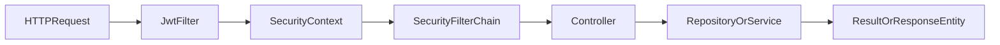

# 后端架构指南

这份文档解释 `talent-platform` 后端是如何组织和运行的。它不是严格教科书式的三层架构，而是一个“按层分包、服务能力混合、控制器直接承接部分业务逻辑”的单体应用。

后端工程位于 [`../backend`](../backend)。

## 1. 技术栈

后端依赖定义在 [`../backend/pom.xml`](../backend/pom.xml)。

核心技术包括：

- `Spring Boot 3.2.3`
- `Spring Web`
- `Spring Security`
- `JWT`
- `Spring Data JPA`
- `Spring AOP`
- `Spring WebFlux WebClient`
- `MySQL`
- `Aliyun OSS SDK`
- `Jsoup`
- `OpenPDF`

### 这些技术在本项目中的职责

- `Spring Web`：承载 REST 接口。
- `Spring Security`：做身份认证和路径级权限控制。
- `JWT`：作为无状态登录凭证。
- `JPA`：完成实体映射和数据库操作。
- `AOP`：记录 API 访问日志。
- `WebClient`：调用 DeepSeek API。
- `Jsoup`：抓取外部资讯。
- `OSS SDK`：上传和删除文件。
- `OpenPDF`：虽然已引入依赖，但当前项目没有看到完整 PDF 导出落地。

## 2. 包结构

主包位于 [`../backend/src/main/java/com/talent/platform`](../backend/src/main/java/com/talent/platform)。

常见子包职责如下：

- `config`
  - Spring 配置、AOP、初始化逻辑
- `controller`
  - 对外 REST 接口入口
- `dto`
  - 少量请求对象
- `entity`
  - JPA 实体
- `repository`
  - Spring Data JPA 仓储
- `security`
  - JWT 过滤器、用户加载、工具类
- `service`
  - AI、通知、爬虫、统计、OSS、区块链等服务能力
- `common`
  - 通用返回体 `Result<T>`

## 3. 这不是怎样的架构

理解当前后端，最好先避免几个误解。

### 3.1 不是严格的 Controller -> Service -> Repository 全链路

很多控制器会直接调用 `Repository`，而不是一切都经过 `Service`。

### 3.2 不是全面 DTO 化的接口风格

很多接口：

- 直接接收实体对象
- 或接收 `Map<String, Object>`
- 或直接返回实体对象

### 3.3 不是完整企业级基础设施栈

当前没有看到：

- Redis
- 消息队列
- Flyway / Liquibase
- OpenAPI / Swagger
- 完整测试体系

因此要以“真实实现”来理解它，而不是默认它已经具备所有企业工程基建。

## 4. 核心配置

主配置文件是 [`../backend/src/main/resources/application.yml`](../backend/src/main/resources/application.yml)。

## 4.1 服务配置

- 端口：`8080`
- 文件上传上限：`500MB`

## 4.2 数据源

- 默认数据库：`talent_platform`
- 用户名：`root`
- 密码：`root`

在 Docker Compose 场景下会通过环境变量覆盖成容器内地址。

## 4.3 JPA 行为

- `ddl-auto: update`
- `open-in-view: true`

这两个配置组合意味着：

- 数据表结构会根据实体自动更新
- Web 响应序列化阶段仍允许访问延迟加载对象

它的优点是开发方便，缺点是生产约束较弱，也容易隐藏实体返回和序列化层面的结构问题。

## 4.4 JWT

- `secret` 在配置中给了默认值
- `expiration` 为 `86400000`

也就是 24 小时。

## 4.5 外部集成配置

- DeepSeek
- Aliyun OSS

这些能力依赖环境变量，如果未配置则对应功能可能不可用或降级。

## 5. 认证与鉴权

鉴权核心在 [`../backend/src/main/java/com/talent/platform/config/SecurityConfig.java`](../backend/src/main/java/com/talent/platform/config/SecurityConfig.java)。

## 5.1 认证方式

项目使用：

- 用户名密码登录
- 登录成功后签发 JWT
- 后续请求通过 `Authorization: Bearer <token>` 访问受保护接口

### 核心组件

- `JwtFilter`
- `JwtUtil`
- `UserDetailsServiceImpl`
- `SecurityConfig`

## 5.2 安全链行为

## 5.3 路径级权限

安全配置的大体策略是：

- `/api/auth/**` 公开
- 多个 `GET` 接口公开，例如新闻、课程、岗位、统计、区块链、部分匹配能力
- `/api/admin/**` 仅管理员
- `/api/ai/admin/**` 仅管理员
- `/api/ai/match-talents` 仅企业和管理员
- `/api/talents` 公共人才浏览仅企业和管理员

## 5.4 401 / 403 处理

`SecurityConfig` 中自定义了 JSON 返回：

- `401`：`{"code":401,"message":"请先登录"}`
- `403`：`{"code":403,"message":"权限不足"}`

这与前端拦截器的处理方式是配套的。

## 5.5 权限实现的现实特点

当前权限不是全靠路径规则，也不是全靠注解，而是：

- 一部分在 `SecurityConfig`
- 一部分在控制器内部的 owner/admin 判断

所以分析某个接口是否安全，不能只看一个地方。

## 6. 请求、响应与错误风格

## 6.1 统一返回体

大多数接口使用 [`../backend/src/main/java/com/talent/platform/common/Result.java`](../backend/src/main/java/com/talent/platform/common/Result.java)：

- `code`
- `message`
- `data`

### 常见模式

- 成功：`code = 200`
- 普通业务失败：`code = 400` 或自定义业务码

### 一个很重要的现实点

很多“业务失败”并不是返回真实 HTTP 4xx，而是：

- HTTP 200
- `Result.fail(...)`

但认证失败和权限不足会返回真实 `401/403`。

因此前端既要判断 HTTP 状态，也要判断业务返回体语义。

## 6.2 返回风格不完全统一

虽然大部分控制器返回 `Result<T>`，但通知等部分接口也会使用 `ResponseEntity<?>`。

这说明项目在接口风格上有一定统一意图，但还没有完全收敛。

## 7. 控制器、服务与仓储的职责分布

## 7.1 控制器

控制器目录见 [`../backend/src/main/java/com/talent/platform/controller`](../backend/src/main/java/com/talent/platform/controller)。

当前共有以下主控制器：

- `AuthController`
- `CompanyController`
- `JobController`
- `ApplicationController`
- `TalentController`
- `RecruitmentController`
- `MatchController`
- `AiController`
- `CourseController`
- `BlockchainController`
- `NewsController`
- `AdminNewsController`
- `AdminController`
- `NotificationController`
- `StatsController`
- `FileController`

### 控制器层现实特征

- 很多接口直接在控制器层完成参数、身份、所有权校验
- 一些 CRUD 接口直接调用仓储层
- 复杂外部能力则交给 `Service`

## 7.2 Service 层

真正比较“像服务层”的模块集中在：

- `AiService`
- `NotificationService`
- `StatsService`
- `BlockchainService`
- `OssService`
- `CrawlerService`

这些服务主要承担：

- 外部系统调用
- 跨模块协调
- 较重的业务逻辑
- 统计计算

## 7.3 Repository 层

仓储目录见 [`../backend/src/main/java/com/talent/platform/repository`](../backend/src/main/java/com/talent/platform/repository)。

这里主要使用：

- 方法命名查询
- 少量 `@Query`
- 聚合统计查询

整体是标准的 Spring Data JPA 使用方式。

## 8. 业务域划分

从后端角度，可以把项目拆成几个业务域。

### 8.1 认证与账号

- 登录
- 注册
- 角色识别
- JWT 发放

### 8.2 人才与企业

- 人才档案
- 企业资料
- 企业审核
- 人才公开展示

### 8.3 招聘主流程

- 岗位发布
- 岗位浏览
- 投递申请
- 申请状态流转

### 8.4 学习与证书

- 课程管理
- 报名
- 学习进度
- 证书发放
- 区块链存证

### 8.5 AI 模块

- 人岗匹配
- 岗位匹配人才
- 课程推荐
- 职业评估

### 8.6 内容与运营

- 新闻/公告/政策内容
- 内容采集与审核
- 通知
- 平台统计
- API 监控

## 9. 数据初始化机制

初始化逻辑位于 [`../backend/src/main/java/com/talent/platform/config/DataInitializer.java`](../backend/src/main/java/com/talent/platform/config/DataInitializer.java)。

它会在应用启动时：

- 创建默认管理员 `admin / admin123`
- 当企业表为空时灌入演示企业、岗位、资讯和课程

### 这对开发和演示的意义

- 新人本地跑起来后能立刻有可展示数据
- 便于答辩与功能演示
- 但不适合当作生产初始化策略长期保留

## 10. 外部集成

## 10.1 DeepSeek

用于：

- AI 匹配岗位
- AI 匹配人才
- AI 推荐课程
- AI 职业评估
- AI 推荐展示人才

### 实现思路

后端将业务数据整理为 prompt 或上下文，再调用 DeepSeek 接口，最后把 AI 输出和真实业务实体结合成响应。

## 10.2 Aliyun OSS

用于：

- 头像
- 企业 Logo
- 课程封面
- 课程视频
- 其他文件上传

文件接口由 `FileController` 承接。

## 10.3 爬虫

爬虫由 `CrawlerService` 实现，主要用于抓取资讯类内容。

这里有一个现实情况：

- 新闻类抓取有实现
- 政策抓取目前还是占位状态

## 10.4 区块链

这里的“区块链”是模拟实现，不是外部公链或联盟链。

核心目的是：

- 生成哈希链
- 保存学习证书的上链信息
- 支撑后台链状态展示和验证

## 11. 监控与统计

监控和统计主要通过两部分实现：

- `ApiLogAspect` 记录接口访问日志
- `StatsService` 聚合业务数据并提供图表所需结果

这使得后台可以展示：

- API 调用趋势
- 热门接口
- 业务统计数据
- 趋势图表

## 12. 当前后端最值得学习的地方

- 权限与业务边界是怎么混合实现的
- 单体项目如何承载多个业务域
- AI、爬虫、OSS、统计、区块链如何被整合到同一后端
- JPA 实体如何直接支撑前后台多个功能
- 初始化数据如何服务于演示型项目

## 13. 当前后端最值得警惕的地方

- 接口风格不完全统一
- 业务和权限检查经常散落在控制器中
- 没有系统化异常处理
- 没有数据库迁移工具
- 测试极少
- 部分接口存在越权风险，需要逐个控制器核查

## 14. 建议的后端阅读顺序

1. `application.yml`
2. `SecurityConfig.java`
3. `AuthController.java`
4. `TalentController.java`
5. `CompanyController.java`
6. `JobController.java`
7. `ApplicationController.java`
8. `AiController.java`
9. `CourseController.java`
10. `BlockchainController.java`
11. `AdminController.java`
12. `DataInitializer.java`

## 15. 下一步阅读建议

- 想系统看实体关系与字段含义，看 [`05-domain-models.md`](./05-domain-models.md)
- 想按接口和业务流深入，看 [`06-api-and-business-flows.md`](./06-api-and-business-flows.md)
- 想直接上手运行和部署，看 [`07-developer-setup-and-deploy.md`](./07-developer-setup-and-deploy.md)
