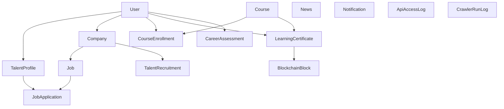

# 领域模型与数据结构详解

这份文档面向技术学习者，系统梳理后端的实体模型、字段语义、关系结构和典型生命周期。

实体目录位于 [`../backend/src/main/java/com/talent/platform/entity`](../backend/src/main/java/com/talent/platform/entity)。

当前共有 15 个核心实体。

## 1. 先从整体关系理解

## 2. 账户与身份域

## 2.1 `User`

文件：[`../backend/src/main/java/com/talent/platform/entity/User.java`](../backend/src/main/java/com/talent/platform/entity/User.java)

### 作用

系统统一账号表，是所有身份能力的根。

### 关键字段

- `username`
- `password`
- `email`
- `phone`
- `role`
- `createTime`

### 角色枚举

- `ADMIN`
- `TALENT`
- `ENTERPRISE`

### 关系

- 一个 `User` 可以对应一个 `TalentProfile`
- 一个 `User` 可以对应一个 `Company`
- 一个 `User` 可以有多条 `CourseEnrollment`
- 一个 `User` 可以有多条 `LearningCertificate`
- 一个 `User` 可以有多条 `CareerAssessment`

### 建模意义

`User` 负责“身份”，而不是“业务资料”。人才和企业的扩展字段都拆到了独立实体中，这是一种比较清晰的身份-资料分层方式。

## 2.2 `TalentProfile`

文件：[`../backend/src/main/java/com/talent/platform/entity/TalentProfile.java`](../backend/src/main/java/com/talent/platform/entity/TalentProfile.java)

### 作用

人才档案，相当于平台内部简历。

### 关键字段

- `realName`
- `skills`
- `education`
- `graduationSchool`
- `major`
- `workYears`
- `expectedPosition`
- `expectedSalary`
- `experience`
- `projectExperience`
- `selfIntroduction`
- `certificates`
- `city`
- `avatarUrl`
- `status`
- `featured`
- `featuredOrder`
- `visible`

### 关系

- `@OneToOne user`
- 被 `JobApplication` 作为申请人引用

### 展示相关字段

- `visible`：是否允许公开展示
- `featured`：是否为精选人才
- `featuredOrder`：精选排序

### 设计点评

这个实体同时承载：

- 简历信息
- 展示信息
- 平台运营信息

好处是方便，缺点是职责稍重。

## 2.3 `Company`

文件：[`../backend/src/main/java/com/talent/platform/entity/Company.java`](../backend/src/main/java/com/talent/platform/entity/Company.java)

### 作用

企业资料和审核状态载体。

### 关键字段

- `companyName`
- `industry`
- `description`
- `contactEmail`
- `contactPhone`
- `scale`
- `address`
- `website`
- `logoUrl`
- `auditStatus`
- `visible`

### 审核状态

- `PENDING`
- `APPROVED`
- `REJECTED`

### 关系

- `@OneToOne user`
- 被 `Job` 引用
- 被 `TalentRecruitment` 引用

### 业务意义

企业资料不只是展示信息，它还直接控制：

- 能否发布岗位
- 是否对外可见
- 是否进入正常招聘流程

## 3. 招聘主流程域

## 3.1 `Job`

文件：[`../backend/src/main/java/com/talent/platform/entity/Job.java`](../backend/src/main/java/com/talent/platform/entity/Job.java)

### 作用

标准招聘岗位。

### 关键字段

- `title`
- `description`
- `requirements`
- `salaryRange`
- `city`
- `status`
- `createTime`

### 关系

- `@ManyToOne company`
- 被 `JobApplication` 引用

### 状态

`status` 当前使用普通字符串，默认值是 `"OPEN"`。

### 设计点评

这里没有用枚举而是用字符串，开发速度快，但长期维护时更容易出现状态值漂移。

## 3.2 `JobApplication`

文件：[`../backend/src/main/java/com/talent/platform/entity/JobApplication.java`](../backend/src/main/java/com/talent/platform/entity/JobApplication.java)

### 作用

岗位投递记录，是招聘闭环中的核心连接实体。

### 关键字段

- `status`
- `applyTime`

### 关系

- `@ManyToOne talent`
- `@ManyToOne job`

### 状态枚举

- `PENDING`
- `ACCEPTED`
- `REJECTED`

### 生命周期

1. 人才投递时创建
2. 初始状态为 `PENDING`
3. 企业审核后改为 `ACCEPTED` 或 `REJECTED`

## 3.3 `TalentRecruitment`

文件：[`../backend/src/main/java/com/talent/platform/entity/TalentRecruitment.java`](../backend/src/main/java/com/talent/platform/entity/TalentRecruitment.java)

### 作用

另一类招聘需求实体，更偏“人才引进/专项招募需求”。

### 关键字段

- `title`
- `requirements`
- `targetSkills`
- `city`
- `salaryRange`
- `status`
- `createTime`

### 关系

- `@ManyToOne company`

### 状态枚举

- `OPEN`
- `CLOSED`

### 为什么容易让人困惑

项目中同时存在 `Job` 和 `TalentRecruitment` 两种招聘类实体：

- `Job` 更像标准岗位
- `TalentRecruitment` 更像另一套公开招聘需求

这类并存设计在学习时一定要明确区分，否则容易把两条业务线混在一起。

## 4. 学习、证书与区块链域

## 4.1 `Course`

文件：[`../backend/src/main/java/com/talent/platform/entity/Course.java`](../backend/src/main/java/com/talent/platform/entity/Course.java)

### 作用

课程主表。

### 关键字段

- `title`
- `description`
- `teacher`
- `category`
- `coverUrl`
- `videoUrl`
- `duration`
- `chapterCount`
- `createTime`

### 关系

- 被 `CourseEnrollment` 引用
- 被 `LearningCertificate` 引用

### 说明

课程分类当前是普通字符串字段，而不是枚举。

## 4.2 `CourseEnrollment`

文件：[`../backend/src/main/java/com/talent/platform/entity/CourseEnrollment.java`](../backend/src/main/java/com/talent/platform/entity/CourseEnrollment.java)

### 作用

记录用户是否报名、学到哪里、学了多久。

### 关键字段

- `enrollTime`
- `progress`
- `studyHours`
- `lastStudyTime`
- `status`

### 关系

- `@ManyToOne user`
- `@ManyToOne course`

### 业务约束

同一用户和同一课程之间存在唯一约束，这意味着同一门课不能重复报名出多条记录。

### 状态

当前 `status` 使用普通字符串，默认值为 `"LEARNING"`。

### 生命周期

1. 报名时创建
2. 学习过程中不断更新进度和时长
3. 进度到 100 时变成完成态

## 4.3 `LearningCertificate`

文件：[`../backend/src/main/java/com/talent/platform/entity/LearningCertificate.java`](../backend/src/main/java/com/talent/platform/entity/LearningCertificate.java)

### 作用

课程完成后的证书记录。

### 关键字段

- `certificateNo`
- `blockHash`
- `issueTime`
- `status`

### 关系

- `@ManyToOne user`
- `@ManyToOne course`

### 与区块链的关系

证书并不是直接 `@ManyToOne BlockchainBlock`，而是通过 `blockHash` 做弱关联。

这说明：

- 证书侧只记录“我上链到哪个区块”
- 区块并不知道“我被哪个证书实体持有”

### 状态

当前 `status` 是普通字符串，默认值 `"VALID"`。

## 4.4 `BlockchainBlock`

文件：[`../backend/src/main/java/com/talent/platform/entity/BlockchainBlock.java`](../backend/src/main/java/com/talent/platform/entity/BlockchainBlock.java)

### 作用

模拟区块链区块。

### 关键字段

- `blockIndex`
- `previousHash`
- `hash`
- `data`
- `timestamp`
- `nonce`

### 设计特点

- 不和证书做强关系映射
- 核心逻辑依赖哈希链结构
- 更偏展示和教学用途，而不是严肃区块链落地

## 4.5 `CareerAssessment`

文件：[`../backend/src/main/java/com/talent/platform/entity/CareerAssessment.java`](../backend/src/main/java/com/talent/platform/entity/CareerAssessment.java)

### 作用

保存 AI 职业测评结果快照。

### 关键字段

- `radarData`
- `assessmentReport`
- `suggestions`
- `overallScore`
- `createTime`

### 关系

- `@ManyToOne user`

### 设计特点

雷达图数据和建议是结构化内容，但存储为文本字段，便于快速开发，代价是数据库层面不便做结构化查询。

## 5. 内容与通知域

## 5.1 `News`

文件：[`../backend/src/main/java/com/talent/platform/entity/News.java`](../backend/src/main/java/com/talent/platform/entity/News.java)

### 作用

统一承载资讯、公告、政策。

### 关键字段

- `title`
- `content`
- `author`
- `sourceSite`
- `sourceUrl`
- `publishTime`
- `reviewedAt`
- `reviewedBy`
- `category`
- `sourceType`
- `reviewStatus`

### 分类枚举

- `NEWS`
- `ANNOUNCE`
- `POLICY`

### 来源枚举

- `MANUAL`
- `CRAWLED`

### 审核状态

- `PENDING`
- `APPROVED`
- `REJECTED`

### 生命周期

#### 手工公告

1. 管理员创建
2. `sourceType = MANUAL`
3. 通常直接 `APPROVED`

#### 爬取资讯

1. 爬虫抓取
2. `sourceType = CRAWLED`
3. 默认 `PENDING`
4. 管理员审核后公开

## 5.2 `Notification`

文件：[`../backend/src/main/java/com/talent/platform/entity/Notification.java`](../backend/src/main/java/com/talent/platform/entity/Notification.java)

### 作用

站内通知。

### 关键字段

- `userId`
- `title`
- `content`
- `type`
- `relatedId`
- `read`
- `createTime`

### 类型

通知类型较多，常见包括：

- 新申请通知
- 企业审核结果
- 证书发放
- 欢迎消息

### 一个很有代表性的设计点

它没有把 `User` 做成对象关联，而是直接存 `userId`。

优点：

- 灵活
- 简单

缺点：

- 数据库层约束变弱
- 阅读实体时不如强关系直观

## 6. 运维与系统观察域

## 6.1 `ApiAccessLog`

文件：[`../backend/src/main/java/com/talent/platform/entity/ApiAccessLog.java`](../backend/src/main/java/com/talent/platform/entity/ApiAccessLog.java)

### 作用

记录 API 调用情况。

### 关键字段

- `method`
- `uri`
- `username`
- `ip`
- `costMs`
- `statusCode`
- `createTime`

### 用途

- 后台系统监控
- 访问趋势
- 热门接口统计
- 简易审计

## 6.2 `CrawlerRunLog`

文件：[`../backend/src/main/java/com/talent/platform/entity/CrawlerRunLog.java`](../backend/src/main/java/com/talent/platform/entity/CrawlerRunLog.java)

### 作用

记录一次爬虫任务运行情况。

### 关键字段

- `startedAt`
- `finishedAt`
- `jobsInserted`
- `newsInserted`
- `totalInserted`
- `errorCount`
- `success`
- `messagesJson`

### 特点

`messagesJson` 本质上是把一组消息序列化到文本字段中，体现了这个项目偏实用主义的实现方式。

## 7. 状态字段设计风格

这是学习当前项目时必须注意的一个点：状态字段并不统一。

## 7.1 用枚举的字段

- `User.role`
- `Company.auditStatus`
- `JobApplication.status`
- `TalentRecruitment.status`
- `News.category`
- `News.sourceType`
- `News.reviewStatus`
- `Notification.type`

## 7.2 用普通字符串的字段

- `TalentProfile.status`
- `Job.status`
- `CourseEnrollment.status`
- `LearningCertificate.status`

### 这意味着什么

如果后续要进一步工程化，优先值得改造的一类点就是把字符串状态逐步枚举化。

## 8. 这个领域模型的优点

- 业务主线完整
- 用户、企业、岗位、申请、课程、证书、资讯、通知等核心对象基本齐全
- 非常适合做完整业务链演示
- 身份和资料分离较清晰
- 学习记录、证书、区块链链路有较完整的建模

## 9. 这个领域模型的局限

- 某些实体职责偏重
- 状态字段风格不统一
- 部分关系是弱关联而非强关联
- 招聘相关实体存在双线并存，容易造成认知成本
- 一些结构化信息被塞入文本字段，长期维护和查询能力较弱

## 10. 推荐的学习顺序

1. `User`
2. `TalentProfile`
3. `Company`
4. `Job`
5. `JobApplication`
6. `Course`
7. `CourseEnrollment`
8. `LearningCertificate`
9. `BlockchainBlock`
10. `News`
11. `Notification`
12. `CareerAssessment`

## 11. 下一步阅读建议

- 想看这些实体如何在接口中流转，看 [`06-api-and-business-flows.md`](./06-api-and-business-flows.md)
- 想看哪些模型设计仍有改进空间，看 [`08-known-gaps-and-evolution.md`](./08-known-gaps-and-evolution.md)
