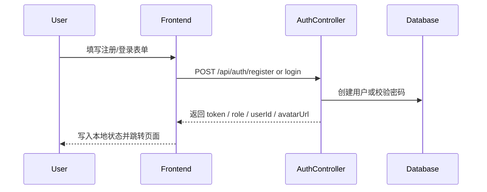
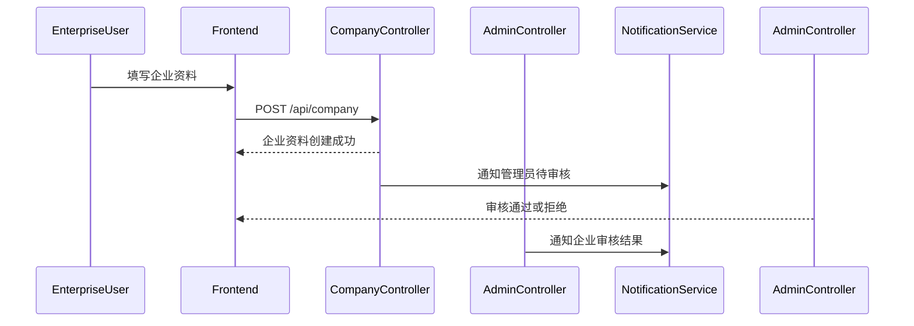
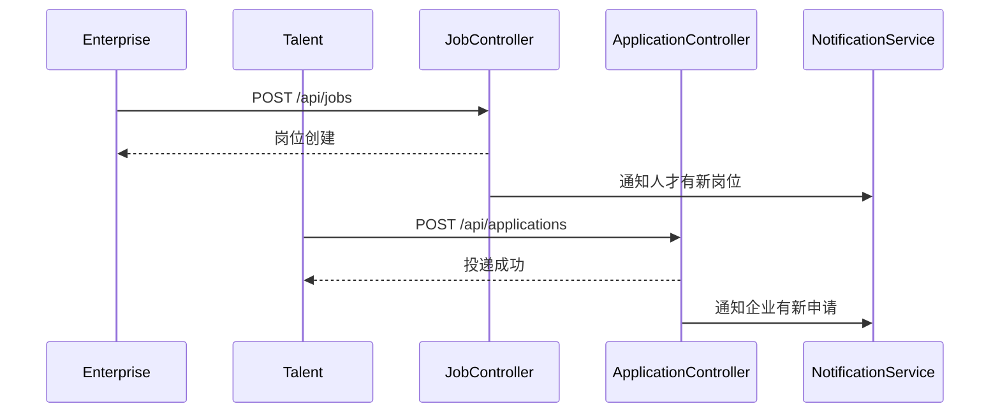
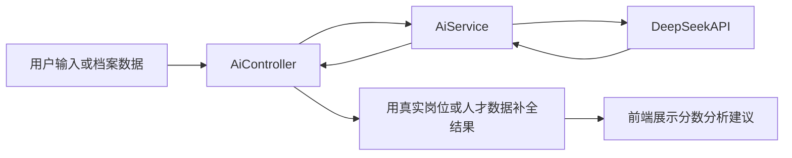
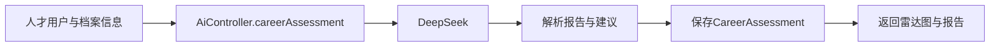
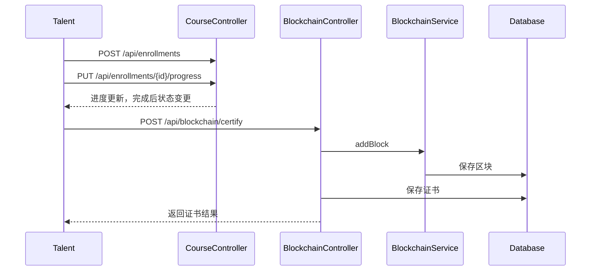
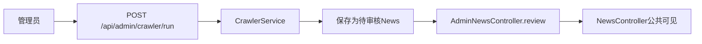

# API 与业务流程详解

这份文档从“控制器 + 业务域 + 关键链路”的角度解释后端接口是如何支撑整个平台的。

如果你要联调前后端、梳理答辩讲解逻辑，或者准备二次开发，这一篇会非常重要。

## 1. 控制器总表

后端控制器位于 [`../backend/src/main/java/com/talent/platform/controller`](../backend/src/main/java/com/talent/platform/controller)。

## 1.1 认证与身份

- `AuthController`

## 1.2 招聘主流程

- `CompanyController`
- `JobController`
- `ApplicationController`
- `TalentController`
- `RecruitmentController`
- `MatchController`

## 1.3 AI 与学习

- `AiController`
- `CourseController`
- `BlockchainController`

## 1.4 资讯、运营、系统

- `NewsController`
- `AdminNewsController`
- `AdminController`
- `NotificationController`
- `StatsController`
- `FileController`

## 2. 按业务域理解接口

## 2.1 认证与账号

### `AuthController`

基础路径：`/api/auth`

主要接口：

- `POST /register`
- `POST /login`

### 典型语义

#### 注册

- 创建基础账号
- 角色通常是 `TALENT` 或 `ENTERPRISE`
- 不会自动创建完整人才档案或企业资料

#### 登录

- 校验用户名密码
- 返回 `token`
- 同时返回 `role`、`userId`、`avatarUrl`

### 学习重点

登录接口不是只返回 token，而是直接返回前端初始化会用到的关键信息。这使得前端登录后能立刻恢复用户界面状态。

## 2.2 人才档案

### `TalentController`

基础路径：`/api/talents`

主要接口：

- `GET /`
- `GET /showcase`
- `GET /{id}`
- `GET /my`
- `POST /`
- `PUT /{id}`
- `DELETE /{id}`

### 权限规律

- `GET /my`：人才或管理员
- 公共人才浏览接口：企业或管理员
- 写接口：要求登录，并在部分场景检查是否本人或管理员

### 业务语义

- `/`：公开人才列表
- `/showcase`：精选人才
- `/my`：当前登录用户自己的人才档案

### 设计观察

这是一个很典型的“同一实体面向三种读者”的控制器：

- 平台本人编辑
- 企业浏览
- 管理员运营控制

## 2.3 企业资料

### `CompanyController`

基础路径：`/api/company`

主要接口：

- `GET /my`
- `POST /`
- `PUT /{id}`

### 业务语义

- 企业创建资料
- 企业查看自己的资料
- 企业修改资料

### 一个关键点

企业资料不是创建完就能发岗，必须等待管理员审核通过。

## 2.4 岗位与申请

### `JobController`

基础路径：`/api/jobs`

主要接口：

- `GET /`
- `GET /{id}`
- `GET /my`
- `POST /`
- `PUT /{id}`
- `DELETE /{id}`

### 业务语义

- 普通访客可以浏览岗位
- 企业可查看自己发布的岗位
- 企业审核通过后才能创建岗位
- 管理员对某些岗位操作也有权限

### `ApplicationController`

基础路径：`/api/applications`

主要接口：

- `POST /`
- `GET /my`
- `GET /company`
- `PUT /{id}/status`

### 业务语义

- 人才申请岗位
- 人才查看自己的申请
- 企业查看自己收到的申请
- 企业处理申请状态

### 一个很值得学习的点

这里把“人才视角”和“企业视角”的申请管理统一进了一个控制器，也让前端的 `/my-applications` 页面可以角色复用。

## 2.5 普通匹配与 AI 匹配

### `MatchController`

基础路径：`/api/match`

主要接口：

- `GET /`
- `GET /talents`

### 作用

这是非 AI 的普通匹配/搜索能力：

- 一个偏岗位检索
- 一个偏人才检索

### `AiController`

基础路径：`/api/ai`

主要接口：

- `POST /match`
- `POST /match-talents`
- `POST /recommend-courses`
- `POST /career-assessment`
- `GET /assessments`
- `GET /assessments/{id}`
- `GET /admin/recommend-showcase`

### 作用

这是 AI 模块的核心控制器。

它覆盖：

- 人才找岗位
- 企业找人才
- 课程推荐
- 职业测评
- 后台人才推荐

### 典型实现思路

1. 读取业务数据
2. 拼装 prompt 或上下文
3. 调用 DeepSeek
4. 解析 AI 输出
5. 再结合真实业务实体做 enrich
6. 返回适合前端展示的结果

## 2.6 课程、学习与证书

### `CourseController`

基础路径：`/api`

主要接口：

- `GET /courses`
- `GET /courses/{id}`
- `POST /courses`
- `PUT /courses/{id}`
- `DELETE /courses/{id}`
- `POST /enrollments`
- `GET /enrollments/my`
- `PUT /enrollments/{id}/progress`

### 作用

这个控制器同时承担：

- 课程内容管理
- 课程报名
- 学习进度维护

这在项目规模不大时很常见，但长期可能需要拆分。

### `BlockchainController`

基础路径：`/api/blockchain`

主要接口：

- `GET /chain`
- `GET /verify`
- `GET /admin/stats`
- `GET /admin/certificates`
- `GET /block/{hash}`
- `POST /certify`
- `GET /certificates`
- `GET /certificates/{id}`

### 作用

- 查看链
- 验证链完整性
- 发放证书
- 查看证书详情
- 提供后台区块链统计

## 2.7 内容与资讯

### `NewsController`

基础路径：`/api/news`

主要接口：

- `GET /`
- `GET /{id}`
- `POST /`
- `PUT /{id}`
- `DELETE /{id}`

### 作用

统一承载资讯、公告、政策内容的公共读取，以及部分管理员创建公告的能力。

### `AdminNewsController`

基础路径：`/api/admin/news`

主要接口：

- `GET /`
- `POST /announcements`
- `PUT /announcements/{id}`
- `PUT /{id}/review`
- `DELETE /{id}`

### 作用

这是更贴近“后台治理语义”的资讯控制器。

它负责：

- 后台检索
- 审核爬取内容
- 管理员手工公告

## 2.8 平台管理、通知、统计、文件

### `AdminController`

基础路径：`/api/admin`

负责：

- 用户管理
- 企业审核
- 人才展示管理
- 平台统计
- API 监控
- 爬虫运行状态
- 区块链后台聚合能力

### `NotificationController`

基础路径：`/api/notifications`

负责：

- 消息列表
- 未读数
- 单条已读
- 全部已读

### `StatsController`

基础路径：`/api/stats`

负责：

- 公共统计
- 仪表盘统计
- 月度趋势
- 申请状态统计

### `FileController`

基础路径：`/api/files`

负责：

- 文件上传
- 按 URL 删除文件

## 3. 从前端视角看接口分组

前端 `src/api/index.js` 的分组几乎就是接口地图：

- `authApi`
- `talentApi`
- `jobApi`
- `companyApi`
- `applicationApi`
- `newsApi`
- `courseApi`
- `matchApi`
- `aiApi`
- `blockchainApi`
- `recruitmentApi`
- `fileApi`
- `adminApi`
- `statsApi`
- `notificationApi`

这是理解“页面到底在调哪个后端能力”的最快入口。

## 4. 关键业务流程

## 4.1 注册与登录

### 注册后的现实情况

注册完成只拿到账号，不代表已经具备完整业务资料：

- 人才还要建档
- 企业还要建企业信息

## 4.2 企业入驻与审核

### 这条流程的意义

它决定了企业不是注册后立即拥有全部能力，而是先经过平台审核。

## 4.3 岗位发布与投递

### 投递前通常要满足

- 人才已有档案
- 岗位存在
- 企业审核通过且可见
- 没有重复投递

## 4.4 AI 岗位匹配 / 人才匹配

### 为什么前端看到的结果不是纯模型原文

因为后端通常会：

- 先拿到 AI 推荐结果
- 再重新映射到真实岗位或人才实体
- 补齐标题、企业名、分数字段等展示信息

## 4.5 职业评估

### 持久化意义

职业评估不是一次性页面结果，而是会落库，因此后续还能查看评估历史。

## 4.6 课程学习到证书上链

### 这条链路为什么很有代表性

因为它把：

- 学习
- 业务状态
- 证书
- 区块链

四件事情串成了一条完整业务线，特别适合作为答辩和技术讲解案例。

## 4.7 资讯采集与审核

### 当前要特别说明

政策抓取在当前实现里还是占位状态，不应写成“已完整上线”。

## 5. 接口设计中的真实风格

## 5.1 成功与失败并不总靠 HTTP 状态表达

常见模式是：

- HTTP 200 + `Result.ok(...)`
- HTTP 200 + `Result.fail(...)`

而不是每个业务失败都抛 4xx。

### 前端需要注意

前端如果只看 HTTP 200，不一定代表业务成功。

## 5.2 权限不只在一个地方

分析接口权限时，经常需要同时看：

1. `SecurityConfig`
2. 控制器内部的身份判断
3. 前端路由守卫
4. 页面 catch 行为

## 5.3 一些接口名字听起来像后台，但实际上公开

例如某些统计和区块链读取接口是公开 GET。

这在设计和展示时需要特别说明，否则读者容易误以为所有“管理味道重”的接口都一定需要管理员权限。

## 6. 接口学习建议

如果你是第一次系统读接口，建议按下面顺序：

1. `AuthController`
2. `TalentController`
3. `CompanyController`
4. `JobController`
5. `ApplicationController`
6. `AiController`
7. `CourseController`
8. `BlockchainController`
9. `AdminNewsController`
10. `AdminController`

## 7. 作为二次开发者，你最应该先看什么

- 新增用户流程：`AuthController`、`User`、`useUserStore`
- 新增角色能力：`SecurityConfig`、前端路由 meta、相关控制器
- 新增后台模块：`AdminController` 或 `views/admin`
- 新增 AI 功能：`AiController`、`AiService`
- 新增学习链路：`CourseController`、`BlockchainController`

## 8. 下一步阅读建议

- 想深入理解数据对象本身，看 [`05-domain-models.md`](./05-domain-models.md)
- 想看当前实现的不足和风险，看 [`08-known-gaps-and-evolution.md`](./08-known-gaps-and-evolution.md)
