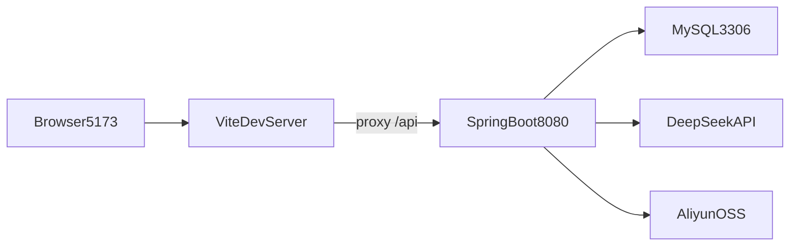

# 开发、运行与部署指南

这份文档面向开发者，说明如何在本地运行项目、如何配置环境变量、如何使用 Docker Compose 部署，以及遇到问题时怎么排查。

## 1. 环境要求

根据项目配置和 README，建议准备：

- `JDK 17+`
- `Maven 3.6+`
- `Node.js 18+`
- `npm`
- `MySQL 8.0`
- `Docker`
- `Docker Compose`

## 2. 项目结构

当前权威项目目录是：

```text
talent-platform/
├── backend/
├── frontend/
├── docs/
├── docker-compose.yml
├── nginx.conf
├── deploy.sh
└── .env.example
```

## 3. 环境变量

环境变量模板见 [`../.env.example`](../.env.example)。

主要变量：

- `DEEPSEEK_API_KEY`
- `OSS_ENDPOINT`
- `OSS_ACCESS_KEY_ID`
- `OSS_ACCESS_KEY_SECRET`
- `OSS_BUCKET_NAME`

### 3.1 哪些是必须的

严格来说，本地最小启动依赖数据库即可，但如果你要体验完整能力，以下配置很关键：

- `DEEPSEEK_API_KEY`：没有它，AI 功能无法正常工作
- OSS 相关：没有它，上传能力无法正常工作

### 3.2 不应直接写入文档的内容

真实环境下的密钥和私有配置不应该进入文档正文，应始终以 `.env.example` 作为说明模板。

## 4. 本地开发模式

本地开发通常是“前后端分开启动”。

## 4.1 启动数据库

如果你本地没有 MySQL，可以先用 Docker 启：

```bash
docker run -d --name mysql8 -p 3306:3306 -e MYSQL_ROOT_PASSWORD=root -e MYSQL_DATABASE=talent_platform mysql:8.0
```

## 4.2 启动后端

```bash
cd backend
mvn spring-boot:run
```

默认监听 `8080`。

### 重要提醒

如果你修改了后端 Java 代码，需要重启后端进程。这个项目不依赖热重载来自动应用变更。

尤其是修改以下内容后，必须重启：

- Controller 接口
- Entity 字段
- Security 配置
- Service 逻辑

## 4.3 启动前端

```bash
cd frontend
npm install
npm run dev
```

默认监听 `5173`。

### 一个非常重要的前端约束

前端使用固定端口 `5173` 且 `strictPort: true`。这样做的原因是：

- 登录态保存在 `localStorage`
- `localStorage` 按 origin 隔离
- 如果开发服务器自动切换端口，容易造成“明明登录过却又像没登录”的混乱

## 4.4 本地联调关系



## 5. 本地开发的默认数据

启动后端时，`DataInitializer` 会：

- 自动创建管理员
- 在企业表为空时注入演示企业、岗位、资讯和课程

这意味着你刚跑起项目时，通常就能直接看到：

- 首页统计和内容
- 若干企业和岗位
- 若干课程

如果你发现首页是空的，优先检查数据库是否初始化成功。

## 6. Docker Compose 部署模式

编排文件见 [`../docker-compose.yml`](../docker-compose.yml)。

当前容器包含三个核心服务：

- `mysql`
- `backend`
- `nginx`

## 6.1 各容器职责

### MySQL

- 镜像：`mysql:8.0`
- 数据库名：`talent_platform`
- 使用卷 `mysql-data` 持久化数据

### Backend

- 基于 `backend/Dockerfile` 构建
- 连接容器内的 `mysql:3306`
- 通过环境变量读取 DeepSeek 和 OSS 配置

### Nginx

- 提供前端静态文件
- 代理 `/api` 到后端

## 6.2 Nginx 行为

[`../nginx.conf`](../nginx.conf) 中主要做了两件事：

- `/` 下托管前端 `dist`
- `/api/` 反向代理到 `backend:8080`

同时把 `Authorization` 头透传给后端。

## 7. 一键部署脚本

[`../deploy.sh`](../deploy.sh) 的流程是：

1. 检查 `.env` 是否存在
2. 构建前端
3. 打包后端
4. 执行 `docker-compose down`
5. 执行 `docker-compose up -d --build`

### 这条脚本适合谁

适合：

- 本地机器性能足够
- 需要快速把当前代码整体部署起来
- 不介意本地构建时间

### 这条脚本不适合谁

如果服务器性能较弱，或者你更想采用“本地构建、服务器只解压并启动容器”的方式，应该参考外层仓库的服务器部署手册而不是直接沿用这里的单脚本思路。

## 8. 推荐的开发流程

### 8.1 前端改动

1. 修改页面、组件、API 或路由
2. 在 `5173` 验证表现
3. 检查和后端接口是否对齐

### 8.2 后端改动

1. 修改 Controller / Entity / Service / Security
2. 重启后端
3. 再用前端或 API 工具验证

### 8.3 鉴权相关改动

需要同时检查：

- `SecurityConfig`
- 前端路由守卫
- `request.js` 的 401/403 行为
- `adminApi` 是否配置 `skipAuthRedirect`

## 9. 常见开发任务与入口

## 9.1 新增一个普通前台功能

通常要改：

- `frontend/src/views`
- `frontend/src/router/index.js`
- `frontend/src/api/index.js`
- `backend/src/main/java/.../controller`
- `backend/src/main/java/.../entity` 或 `repository`

## 9.2 新增一个后台管理功能

通常要改：

- `frontend/src/views/admin`
- `frontend/src/router/index.js`
- `frontend/src/api/index.js` 中的 `adminApi`
- `SecurityConfig`
- `AdminController` 或单独后台控制器

同时要注意后台接口使用 `skipAuthRedirect: true`。

## 9.3 新增一个需要文件上传的能力

通常要检查：

- 前端是否走 `fileApi.upload`
- 后端 `FileController`
- OSS 环境变量是否已配置
- Nginx 和后端上传大小限制是否满足需求

## 10. 常见问题排查

## 10.1 前端起来了，但请求全是 401

先检查：

- 是否已登录
- token 是否过期
- 后端是否真的启动在 `8080`
- 前端代理是否仍指向 `localhost:8080`

## 10.2 修改后端接口后前端还是 404

优先怀疑：

- 后端没有重启
- 实际运行的还是旧进程

## 10.3 AI 功能报错

优先检查：

- `DEEPSEEK_API_KEY` 是否配置
- 外部网络是否可访问 DeepSeek
- 后端日志中是否有 WebClient 调用错误

## 10.4 上传功能报错

优先检查：

- OSS 环境变量是否完整
- 上传目录参数是否合法
- 文件大小是否超过限制

## 10.5 页面老是自动跳回登录页

优先检查：

- 接口是否返回 `401`
- 是否忘了给后台接口配置 `skipAuthRedirect`
- token 是否已过期

## 10.6 Docker 启动后首页打不开

检查：

- `docker-compose ps`
- Nginx 容器是否正常
- 前端 `dist` 是否真的已构建
- `nginx.conf` 是否正确挂载

## 11. 生产部署前应额外注意

当前项目适合演示、学习和轻量部署，但如果面向更严肃的生产使用，至少应补充：

- 更安全的 JWT secret 管理
- 更严格的环境区分
- 更明确的数据库迁移机制
- 更系统的日志与监控
- 完整的测试和回归流程
- 对关键接口的权限审计

## 12. 建议的开发者阅读顺序

1. `README.md`
2. `.env.example`
3. `frontend/vite.config.js`
4. `frontend/src/router/index.js`
5. `frontend/src/api/request.js`
6. `backend/src/main/resources/application.yml`
7. `backend/src/main/java/.../config/SecurityConfig.java`
8. `docker-compose.yml`
9. `nginx.conf`
10. `deploy.sh`

## 13. 下一步阅读建议

- 想理解后端数据结构，看 [`05-domain-models.md`](./05-domain-models.md)
- 想理解接口和业务流，看 [`06-api-and-business-flows.md`](./06-api-and-business-flows.md)
- 想看实现缺口和优化建议，看 [`08-known-gaps-and-evolution.md`](./08-known-gaps-and-evolution.md)
